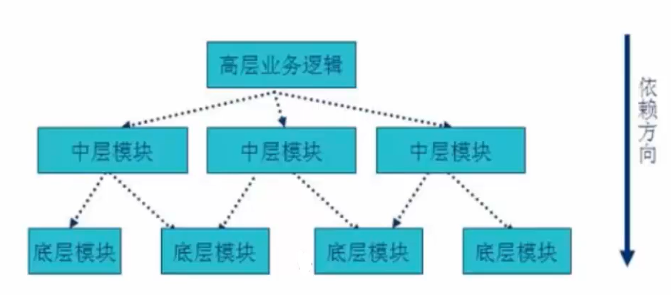

# 设计模式

## 面向对象设计原则

### 01 开闭原则

类的改动是通过增加代码进行的，而不是修改源代码。（对扩展开放，对修改关闭）

### 02 迪米特法则

 一个对象应当对其他对象尽可能少的了解，从而降低各个对象之间的耦合，提高系统的可维护性。

### 03 合成复用原则

如果使用继承，会导致父类的任何变换都可能影响到子类的行为，如果使用对象组合，就降低了这种依赖关系，对于继承和组合，优先使用组合。

### 04 依赖倒转原则

依赖于抽象（接口），不依赖于具体的实现（类）

传统的过程式设计倾向于使高层次的模块依赖于低层次的模块，抽象层依赖于具体的层次。

## 创建型模式

### 05 简单工厂模式

- 优点：1.客户端和具体实现类解耦；2.对于某些对象创建过程比较复杂的情况，不用考虑这些。

- 缺点：1.简单工厂模式，增加新的功能是通过修改源代码实现，不符合开闭原则；2.这个类职责过重，类发生问题，会影响很多使用这个工厂的模块。

### 06 工厂方法模式

- 优点：1.实现了对象创建和使用的分离；2.系统的可扩展性变得非常好，无需修改接口和原类，符合开闭原则。

- 缺点：1.类的个数成倍增加，导致类越来越多，增加维护成本；2.增加了系统的抽象性和理解难度。

### 07 抽象工厂模式

抽象工厂针对的是产品族，而不是产品等级结构（产品族：同一产地或同一产商，功能不同；产品等级：功能相同，产地或产商不同）

### 08 单例模式

保证一个类仅有一个实例，并提供一个访问它的全局访问点
实现步骤：
       1. 构造函数私有化
       2. 增加静态私有的当前类的指针变量
       3. 提供静态的对外接口，可以让用户获得单例对象

## 结构型模式

### 09 代理模式

定义：为其他对象提供一种代理以控制对这个对象的访问。
在某些情况下，一个对象不适合或者不能直接引用另一个对象，而代理对象可以在客户端和目标对象之间起到中介的作用。

### 10 外观模式

将复杂的子类系统抽象到同一个接口进行管理，外界只需要通过此接口与子类系统进行交互，而不必要直接与复杂的子类系统进行交互。

### 11 适配器模式

将一个类的接口转换成客户希望的另外一个接口，使得原本由于接口不兼容而不能一起工作的类可以一起工作。

## 行为型模式

### 12 模板方法模式

定义一个操作中算法的框架，而将一些步骤延迟到子类中。模板方法模式使得子类可以不改变一个算法的结构即可重定义该算法的某些特定步骤。

- 优点：
  - 在父类中形式化地定义一个算法，而由它的子类来实现细节的实现，在子类实现详细的处理算法时并不会改变算法中步骤的执行次序。
  - 模板方法模式一种代码复用技术，它在类库设计中尤为重要，它提取了类库中的公共行为，将公共行为放在父类中，而通过其子类来实现不同的行为，它鼓励我们恰当使用继承来实现代码复用。
  - 可实现一种反向控制结构，通过子类覆盖父类的钩子方法来决定某一特定步骤是否需要执行。
  - 在模板方法模式中可以通过子类来覆盖父类的基本方法，不同的子类可以提供基本方法的不同实现，更换和增加新的子类很方便，符合单一职责原则和开闭原则。

### 13 策略模式

策略模式定义了一系列的算法，并将每一个算法封装起来，而且使它们还可以相互替换。策略模式让算法独立于使用它的客户而独立变化。

### 14 命令模式（动作/事务模式）

将一个请求封装一个对象，从而让我们可用不同的请求对客户进行参数化；对请求排队或记录请求日志，以及支持可撤销的操作。

命令模式可以将请求发送者和接收者完全解耦，发送者与接受者之间没有直接引用关系，发送请求的对象只需要知道如何发送请求，而不必知道如何完成请求。

### 15 观察者模式

观察者模式是用于建立一种对象与对象之间的依赖关系，一个对象发生改变时将自动通知其他对象，其他对象将相应作出反应。在观察者模式中，发生改变的对象称为观察目标，而被通知的对象称为观察者，一个观察目标可以对应多个观察者。

### 16 装饰模式（包装模式）

通过一种对客户端透明的方法来扩展对象功能，是继承关系的一种替代。

装饰模式就是把要附加的功能分别放在单独的类中，并让这个类包含它要装饰的对象，当需要执行时，客户端就可以有选择的、按顺序的使用装饰功能包装。

一般情况下，用继承实现类的功能扩展，装饰模式可以动态的给一个类增加功能。